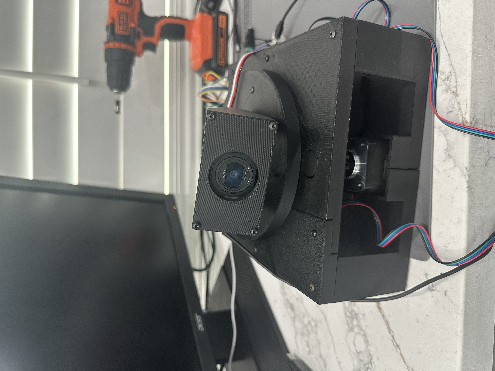
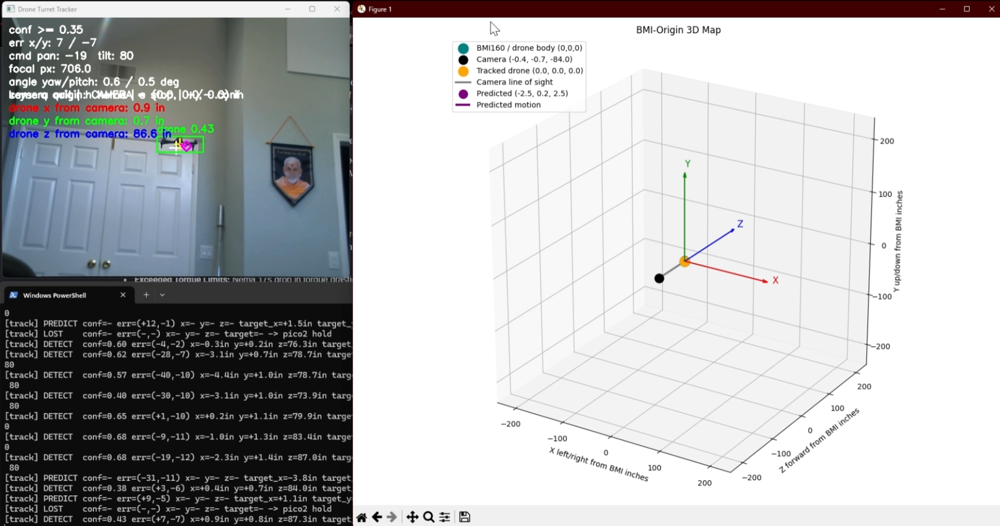
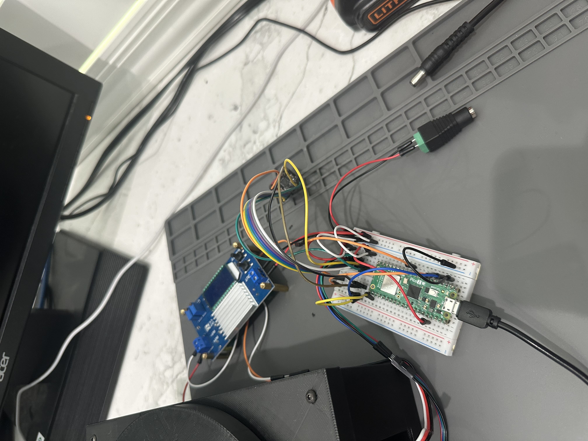
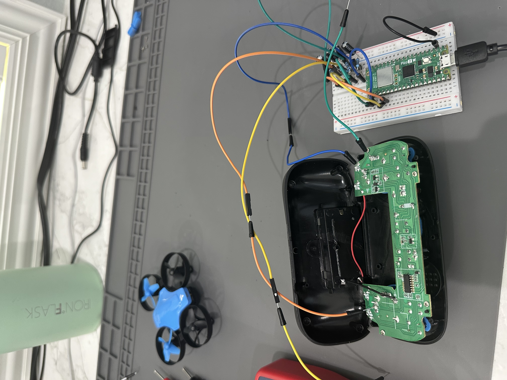
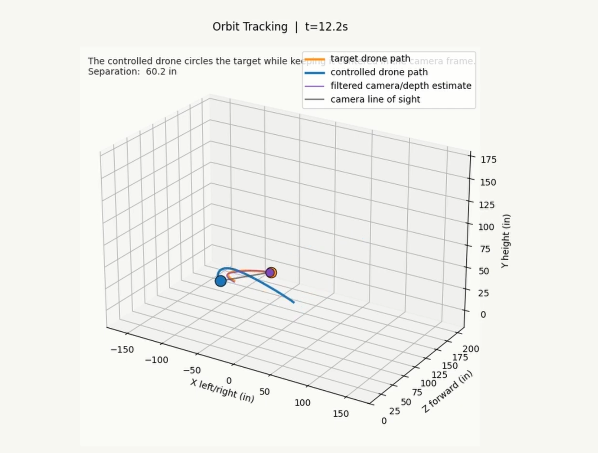
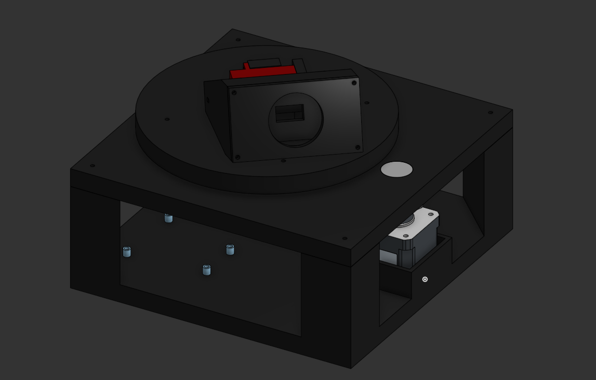
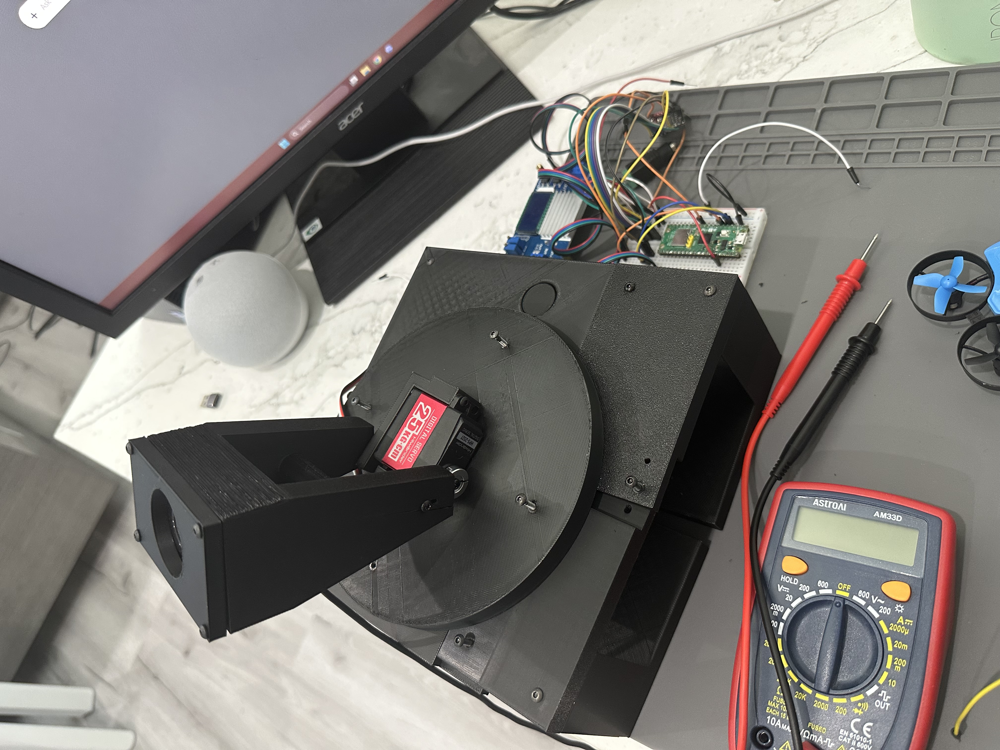
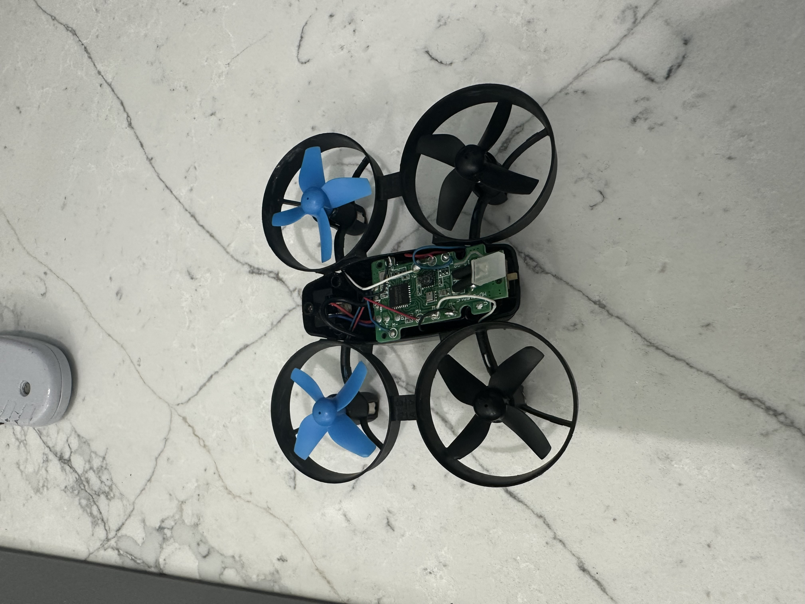
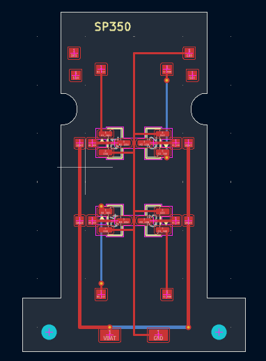
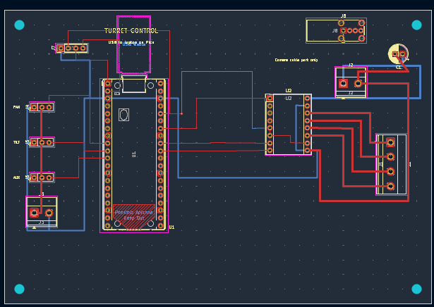

# DroneDetection

This is my drone tracking and turret project. The main goal was to detect a drone with a camera, estimate where it is in 3D space, and move a pan/tilt turret so the camera stays pointed at it.

I am Aarav Patel. I started this project as a computer vision turret, but it turned into a bigger system while I was building it. I worked on the YOLO detector, the live tracker, the Pico turret firmware, the CAD, and two custom PCBs. I also tried controlling a small commercial drone through its controller, but that got messy, so I moved toward custom electronics for the drone frame instead.

The project is not a finished product. It is a working prototype and a record of what I built, tested, changed, and still need to finish.

## Current Status

- The YOLOv8 drone detector works.
- The live camera tracker works.
- The tracker estimates the drone position relative to the camera.
- The tracker predicts short-term movement so the turret does not only react to the last frame.
- The Pico 2 turret controller moves pan with a stepper motor and tilt with a servo.
- Stepper acceleration ramping is in the firmware so the motor stalls less.
- The turret has been tested with live tracking and depth estimates.
- The drone PCB and turret PCB are designed and have fabrication files.
- The next hardware step is assembling and testing the manufactured boards.

## Project Photos









## Demo Links

| Demo | What it shows | Repo file | Drive link |
| --- | --- | --- | --- |
| YouTube project demo | Main video for the project | - | [Watch on YouTube](https://youtu.be/fUEFKIeKq6E?si=KoJLhP0QhyuUc3A9) |
| Live turret tracking | The physical turret tracking a detected drone | - | [Drone Tracking Turret.mp4](https://drive.google.com/file/d/1UBQOuaAiReNZodWpAV6A1nRXlFVHGqKZ/view?usp=drivesdk) |
| Detection proof of concept | Camera detection and tracking test | - | [Proof of Concept - Drone Tracked.mp4](https://drive.google.com/file/d/1Y8ixHSbWaxlFa2D4qZv8LF1yn2z77p-x/view?usp=drivesdk) |
| Fast follow simulation | Simulated drone following a target | [MP4](assets/demo_simulations/follow_tracking_demo.mp4) / [GIF](assets/demo_simulations/follow_tracking_demo.gif) | [Drive MP4](https://drive.google.com/file/d/1x22EfQROl3rcCMJz3o-rANU-yGck9Fjs/view?usp=drivesdk) / [Drive GIF](https://drive.google.com/file/d/1ceiqXWkpfdoIr6vI1aE4kro-Gwh2Y9jS/view?usp=drivesdk) |
| Orbit simulation | Simulated drone orbiting around the target | [MP4](assets/demo_simulations/orbit_tracking_demo.mp4) / [GIF](assets/demo_simulations/orbit_tracking_demo.gif) | [Drive MP4](https://drive.google.com/file/d/1vTIU1h2euXmmVWb8Ut7vwJZywcUVn1Vr/view?usp=drivesdk) / [Drive GIF](https://drive.google.com/file/d/1toew0ILT582uKQxMksciPWsyv_LBWJpW/view?usp=drivesdk) |
| Safe standoff simulation | Simulated follow behavior that keeps distance | [MP4](assets/demo_simulations/standoff_tracking_demo.mp4) / [GIF](assets/demo_simulations/standoff_tracking_demo.gif) | [Drive MP4](https://drive.google.com/file/d/1BEXhN5-Scd0X3nanZK4e2Cr_hdrNLuV4/view?usp=drivesdk) / [Drive GIF](https://drive.google.com/file/d/1r3fI6IdqFA_aWafnw3gRHlx3CpV9DbdE/view?usp=drivesdk) |
| Full ship folder | Videos, previews, and extra files | - | [Google Drive folder](https://drive.google.com/drive/folders/1Nn7UfG2TgwVNnhRaEpTsOkTEUmSowxKg) |



The simulation files are here:

- [drone_detector/live_tracker/demo_flight_simulations.ipynb](drone_detector/live_tracker/demo_flight_simulations.ipynb)
- [drone_detector/live_tracker/demo_flight_simulations.py](drone_detector/live_tracker/demo_flight_simulations.py)

To regenerate the simulation clips:

```powershell
cd C:\Users\aptcs\Downloads\Projects\DroneDetection
.\drone_detector\.venv\Scripts\python.exe .\drone_detector\live_tracker\demo_flight_simulations.py --scenario all
```

## CAD

I made the turret CAD in Onshape:

[Open the turret CAD in Onshape](https://cad.onshape.com/documents/1e954f2e6fb0afe0e50c1e47/w/2cc3740a39c70e9d1274ecfc/e/ad41d11dd19aaeac7b789fd0?renderMode=0&uiState=6a3ad88aa638e38f0ba9bea5)



## Project Layout

```text
DroneDetection/
|-- README.md
|-- JOURNAL.md
|-- assets/
|   |-- demo_simulations/          # rendered simulation videos and GIFs
|   `-- project_photos/            # photos, screenshots, and PCB previews
|-- Drone PCB/                     # drone-frame board KiCad files, Gerbers, and STEP
|-- Turret Control PCB/            # turret controller KiCad files, Gerbers, and STEP
|-- drone_detector/
|   |-- live_tracker/              # camera tracking, 3D position, prediction, turret control
|   |-- pico_turret_platformio/    # Pico 2 turret firmware
|   |-- pico_drone_platformio/     # Pico 2 drone-control firmware
|   |-- pico_drone_controller/     # older MicroPython drone-control prototype
|   |-- esp32_drone_bridge/        # ESP32-C3 and BMI160 test work
|   |-- scripts/                   # Docker and workflow helper scripts
|   |-- train_yolov8.py
|   |-- evaluate_model.py
|   `-- run_tracker_sim.ps1
|-- dataset_toolkit/               # dataset scripts and reports
`-- archived/                      # older files I kept for reference
```

## Hardware

### Turret



The turret uses:

- USB camera for video input.
- Raspberry Pi Pico 2 for the turret controller.
- Stepper driver and NEMA 17 stepper for pan.
- Servo for tilt.
- 12V input power.
- 12V-to-8.4V buck/BEC for the servo rail on the turret PCB.
- Custom turret controller PCB to replace the breadboard wiring.

### Drone Frame

I first tried controlling the drone by sending filtered voltage signals into the original controller. It kind of worked, but it was not clean enough. The original joystick circuit kept affecting the voltages, and I did not want the final version to depend on a hacked controller.



After that, I designed a custom board for the small SP350-style drone frame. The board is meant to reuse the frame, motors, and propellers, but make the electronics easier to understand and modify.

The drone PCB includes:

- A compact shape for the reused frame.
- Four brushed motor outputs.
- Pads for motor and battery wires.
- Shared ground and cleaner power routing.
- Space to keep working on offboard control electronics.

## How It Works

### 1. Dataset And Training

I used YOLO-format drone datasets and merged them into one dataset with one class: `drone`. The scripts can merge datasets, clean labels, preview annotations, train the model, and evaluate it.

Main scripts:

- `drone_detector/merge_roboflow_datasets.py`
- `drone_detector/clean_dataset.py`
- `drone_detector/preview_labels.py`
- `drone_detector/train_yolov8.py`
- `drone_detector/evaluate_model.py`

The tracker looks for this model first:

```text
drone_detector/models/production_drone_model.pt
```

If it is not there, it tries this one:

```text
drone_detector/models/drone_roboflow_best.pt
```

### 2. Detection

`drone_detector/live_tracker/turret_tracker.py` reads camera frames and runs YOLOv8. It picks the best drone box, finds the center of that box, and compares it to the center of the camera frame.

```text
error_x = box_center_x - frame_center_x
error_y = box_center_y - frame_center_y
```

That error becomes the basic pan and tilt correction.

### 3. 3D Position Estimate

The camera is treated like the origin:

```text
camera = (0.0, 0.0, 0.0) inches
```

The tracker estimates:

```text
x = left/right from the camera center
y = up/down from the camera center
z = forward distance away from the camera
```

Depth comes from the visible width of the drone in the camera image. The code uses the camera focal length, the expected drone width, and the bounding-box width to estimate distance. Then it uses the camera angle to turn that into `x`, `y`, and `z`.

### 4. Prediction

The raw position jumps around because camera detections are noisy. I added filtering so one bad frame does not make the turret move too much.

The prediction code:

- Smooths the measured position.
- Smooths velocity.
- Softens unrealistic jumps.
- Predicts a small amount into the future.
- Limits the prediction arrow length.

Current launcher defaults:

```text
prediction horizon: 0.18 seconds
max prediction step: 14 inches
position smoothing alpha: 0.55
velocity smoothing alpha: 0.30
lost target hold: 0.15 seconds
```

### 5. Pan And Tilt

The Python tracker sends simple USB serial commands to the Pico:

```text
PAN <steps>
TILT <angle>
PANZERO
STATUS
STOP
```

Pan uses the horizontal pixel error. Tilt uses the vertical estimate and stays inside the servo limits. If the target disappears for a short moment, the turret holds the last filtered position instead of instantly snapping somewhere else.

### 6. Stepper Ramp

The Pico firmware ramps the stepper speed at the start and end of a move:

```text
slow start pulse delay -> fast cruise pulse delay -> slow ending pulse delay
```

This helped because the stepper was more likely to stall when it started too fast.

## Quick Start

Run the tracker:

```powershell
cd C:\Users\aptcs\Downloads\Projects\DroneDetection\drone_detector
.\.venv\Scripts\Activate.ps1
.\run_tracker_sim.ps1 -Port COM6 -Source 0
```

Use a lower pan gain if the turret overshoots:

```powershell
.\run_tracker_sim.ps1 -Port COM6 -Source 0 -KpPan 0.40
```

Emergency stop:

```powershell
.\.venv\Scripts\python.exe -c "import serial,time; s=serial.Serial('COM6',115200,timeout=1); time.sleep(1); s.write(b'K\n'); s.flush(); time.sleep(.3); print(s.read(200).decode(errors='ignore').strip()); s.close()"
```

Check Pico status:

```powershell
.\.venv\Scripts\python.exe -c "import serial,time; s=serial.Serial('COM6',115200,timeout=1); time.sleep(1); s.write(b'STATUS\n'); s.flush(); time.sleep(.3); print(s.read(300).decode(errors='ignore').strip()); s.close()"
```

## Upload Pico Turret Firmware

```powershell
cd C:\Users\aptcs\Downloads\Projects\DroneDetection\drone_detector\pico_turret_platformio
..\.venv\Scripts\python.exe -m platformio run -e rpipico2 --target upload
```

## Training Workflow

Put Roboflow YOLOv8 exports here:

```text
drone_detector/data/roboflow_raw/Drone1
drone_detector/data/roboflow_raw/Drone2
drone_detector/data/roboflow_raw/Drone3
```

Run the local workflow:

```powershell
cd C:\Users\aptcs\Downloads\Projects\DroneDetection\drone_detector
python preflight_check.py --fix-dirs
python preflight_check.py
python merge_roboflow_datasets.py
python clean_dataset.py
python preview_labels.py --split train --count 20
python preflight_check.py --smoke-train
```

Train and evaluate:

```powershell
python train_yolov8.py --device auto
python evaluate_model.py --device auto
```

## PCB Files

Both PCB folders include the KiCad project files, Gerbers/drill files, DRC reports, board previews, fabrication ZIPs, and STEP files.





| Board | Fabrication package | STEP file | Preview | Drive links |
| --- | --- | --- | --- | --- |
| SP350 drone-frame PCB | [SP350_PCB_fabrication.zip](Drone%20PCB/SP350_PCB_fabrication.zip) | [Drone PCB.step](Drone%20PCB/Drone%20PCB.step) | [sp350_fc_compact.svg](Drone%20PCB/preview/sp350_fc_compact.svg) | [Gerbers](https://drive.google.com/file/d/1_clK4amSKWlXcbOoY3qKn666rn6Dt4GA/view?usp=drivesdk) / [Preview](https://drive.google.com/file/d/1AM0e_IHqhc1ucxpBFDUrG8czhq44fBtK/view?usp=drivesdk) |
| Turret controller PCB | [Turret_Control_PCB_fabrication.zip](Turret%20Control%20PCB/Turret_Control_PCB_fabrication.zip) | [Turret Control PCB.step](Turret%20Control%20PCB/Turret%20Control%20PCB.step) | [turret_control.svg](Turret%20Control%20PCB/preview/turret_control.svg) | [Gerbers](https://drive.google.com/file/d/1bgDib1TZAem1N0iuNZMGmwHZ0CROYYnE/view?usp=drivesdk) / [Preview](https://drive.google.com/file/d/17CKoOh3Z418mv7G7dEkDwoyh0OWlZMZ4/view?usp=drivesdk) |

The current DRC reports show `0 DRC violations` and `0 unconnected pads` for both boards.

## Debugging And Tuning

The tracker prints lines like this while it runs:

```text
[track] DETECT conf=0.82 err=(+74,-12) x=+8.4in y=+1.2in z=42.0in target_x=+8.4in target_y=+1.2in -> pico2 PAN +37 TILT 86
```

Things I tuned while testing:

- Increase `KpPan` if pan is too slow.
- Decrease `KpPan` if the turret overshoots.
- Increase `deadband-x` if it jitters near the center.
- Decrease `imgsz` for lower latency.
- Increase `imgsz` if detections are unreliable.
- Increase stepper current carefully if the motor stalls under load.
- Increase the slow pulse delay in firmware if the stepper needs an easier start.

## Credits

I designed, assembled, tested, and debugged this project. I also made the turret CAD.

The drone-frame prototype reuses the original Snaptain SP350-style frame, brushed motors, and propellers. Snaptain gets credit for those original commercial drone parts.

I used outside resources while learning about drone controls, PCB design, and simulation work, but the project idea, physical testing, wiring, debugging decisions, dataset work, CAD, and final integration choices are mine.

## Safety

This project is for controlled tracking and electronics testing. When changing firmware, wiring, or control logic, test with the propellers removed or with the drone restrained.

## More Documentation

- [JOURNAL.md](JOURNAL.md): build journal and project timeline.
- [drone_detector/README.md](drone_detector/README.md): training and detector details.
- [drone_detector/live_tracker/README.md](drone_detector/live_tracker/README.md): live tracker notes.
- [drone_detector/pico_turret_platformio/README.md](drone_detector/pico_turret_platformio/README.md): Pico turret firmware.
- [drone_detector/pico_drone_platformio/README.md](drone_detector/pico_drone_platformio/README.md): Pico drone controller firmware.
- [dataset_toolkit/README.md](dataset_toolkit/README.md): dataset tooling.
